# Deploying Pulumi Self Hosted to Azure

This folder and sub folders contain the three Pulumi programs to build the infrastructure and deploy the containers
necessary to run Pulumi' self hosted backend onto Azure Kubernetes Service (AKS).

Relevant Documentation:

* [Self-Hosted Pulumi Service](https://www.pulumi.com/docs/guides/self-hosted/)
* [AKS-Hosted Install](https://www.pulumi.com/docs/guides/self-hosted/aks-hosted/)

> ⚠️ Before proceeding, please take the provided installation code and commit it **as-is** to your own source control.
As you make changes or customize it, please commit these to your repo as well. This will help keep track of customizations
 and updates.
> ℹ️ You will likely want to use one of the [Self-Managed Backends](https://www.pulumi.com/docs/intro/concepts/state/#logging-into-a-self-managed-backend)
 as the state storage for this installer. Please document this (in the repo your store this code, an internal wiki, etc)
 so that future updates will be straightforward for you and your colleagues.

## Installer Revision History
Version ID | Date | Note
---|---|---
1.0 | --- | Initial version of the new aks installer.
2.0 | March, 2026 | Add support for new env vars to enable V2 DB schema. **DO NOT USE THIS VERSION OF THE INSTALLER FOR AN EXISTING INSTALL. CONTACT PULUMI SUPPORT TO MIGRATE THE DB FIRST.**

## Prerequisites

* Domain name and access to create two endpoints:
  * api.{domain} - e.g. api.pulumi.example.com
  * app.{domain} - e.g. app.pulumi.example.com
* TLS certificates for each domain endpoint.  
You can use the following to create self-signed certs:

```bash
openssl \
req -x509 -newkey rsa:4096 -keyout key.pem -out cert.pem \
-days { days_until_expiration } -nodes -subj "/CN={ common_name }" \
-addext "subjectAltName = DNS:{ common_name }"
```

Where `{ days_until_expiration }` is set to a number of days for the cert (e.g. 365).
And, `{ common_name }` is set to `api.{domain}` for the api cert and key and set to `app.{domain}` for the console cert
and key (e.g. api.example.com and app.example.com, respectively).

> ⚠️ If using self-signed certificates, you will need to load the cert into your workstation (e.g. MacOS Keychain Access
so that browser and `pulumi` CLI access work correctly.

## What does each Pulumi program do?

### 01-infrastructure

This contains the base infrastructure needed to run the cluster and application including:

* Active directory application
* Networking
* MySQL server and database
* Storage account and blob storage containers

### 02-kubernetes

This program contains the program to deploy an AKS cluster, alongside the ingress controller.

### 03-application

This program is to deploy the applications to the AKS cluster and also apply the Ingress resource.

## Deployment

### Naming the stacks

To ensure that the Pulumi program can access variables between the three deployments, you'll need to specify unique
stack names. In the instructions below these are names `{stackName1}`, `{stackName2}` and `{stackName3}`.
They can be whatever you want them to be, but they need to be consistent when asked for in the instructions.
**NOTE** The stack names should not include a number as it seems that blob container names can't have numbers in them.

To deploy entire stack, run the following in your terminal:

## 01-infrastructure

* `cd 01-infrastructure`
* `npm install`
* `pulumi stack init {stackName1}` - see note above about NO NUMBERS in stack name
* `pulumi config set azure-native:location {azure region}`
* `pulumi config set networkCidr 10.2.0.0/16` - this should be set to what you want your VNet cidr block to be  
* **Note** if you elect to provide an existing Azure VirtualNetwork, instead of `networkCidr` you'll be required to
 provide the following:`pulumi config set virtualNetworkName someVnet && pulumi config set virtualNetworkResourceGroup vnetResourceGroup`
* `pulumi config set subnetCidr 10.2.1.0/24` - this should be set to what you want your subnet cidr block to be
* `pulumi config set dbSubnetCidr 10.2.2.0/24` - this should be set to what you want your DB subnet cidr block to be
* `az login` - to avoid the following error: `Could not create service principal: graphrbac.ServicePrincipalsClient#Create:Failure`)
* `pulumi up`

## 02-kubernetes

* `cd ../02-kubernetes`

* `npm install`
* `pulumi stack init {stackName2}` - see note above about NO NUMBERS in stack name
* `pulumi config set azure-native:location {azure region}`
* `pulumi config set azureDnsZoneName {DNS_ZONE_NAME}`
* `pulumi config set azureDnsZoneResourceGroupName {DNS_ZONE_RESOURCE_GROUP_NAME}`
* `pulumi config set stackName1 organization/k8s-azure-01-infrastructure/{stackName1}`

The following settings are optional.

* `pulumi config set disableAzureDnsCertManagement true`
**NOTE** this disables the cert-manager deployment which handles SSL certificates. 03-application will need TLS certificates.
* `pulumi config set privateIpAddress {private_ip_from_vnet}` - this will disable the ingress services public IP address
 and deploy an internal load balancer. This blocks all public access to the Pulumi self-hosted app.

* `pulumi up`

## 03-application

* `cd ../03-application`

* `npm install`
* `pulumi stack init {stackName3}` - see note above about NO NUMBERS in stack name
* `pulumi config set stackName1 organization/k8s-azure-01-infrastructure/{stackName1}`
* `pulumi config set stackName2 organization/k8s-azure-02-kubernetes-cluster/{stackName2}`
* `pulumi config set apiDomain {domain for api}`
* `pulumi config set consoleDomain {domain for console}`
* `pulumi config set licenseKey {licenseKey} --secret`
* `pulumi config set agGridLicenseKey {agGridLicenseKey} --secret`
* `pulumi config set imageTag {imageTag}` - Image tags are available on Docker Hub: [pulumi/service](https://hub.docker.com/r/pulumi/service/tags)
* `pulumi config set samlEnabled true` - Enables the SSO login button on the console. See [Initial Organization and SAML Setup](#initial-organization-and-saml-setup) before enabling. If not configuring SAML SSO initially, skip or set to false.

The following settings are optional.  
Note if not set, "forgot password" and email invites will not work but sign ups and general functionality will still work.

* `pulumi config set smtpServer {smtp server:port}` (for example: smtp.domain.com:587)
* `pulumi config set smtpUsername {smtp username}`
* `pulumi config set smtpPassword {smtp password} --secret`
* `pulumi config set smtpFromAddress {smtp from address}` (email address that the outgoing emails come from)
* `pulumi config set recaptchaSiteKey {recaptchaSiteKey}` (this must be a Cloudflare Turnstile widget Site Key)
* `pulumi config set recaptchaSecretKey {recaptchaSecretKey} --secret` (this must be a Cloudflare Turnstile widget Secret Key)
* `pulumi config set ingressAllowList {cidr range list}` (allow list of IPv4 CIDR ranges to allow access to the self-hosted
    Pulumi Cloud. Not setting this will allow the set up to be open to the internet). Proper formatting can be seen [here](https://github.com/kubernetes/ingress-nginx/blob/main/docs/user-guide/nginx-configuration/annotations.md#whitelist-source-range)
* `pulumi config set certManagerEmail {email}` (email address that will be used for certificate expirations
 purposes from letsencrypt)

{< /*<!-- markdownlint-disable MD034 -->*/ >}}
**IF CERT-MANAGER IS NOT ENABLED (on a mac or linux machine)**

* `cat {path to api key file} | pulumi config set apiTlsKey --secret --`
* `cat {path to api cert file} | pulumi config set apiTlsCert --secret --`
* `cat {path to console key file} | pulumi config set consoleTlsKey --secret --`
* `cat {path to console cert file} | pulumi config set consoleTlsCert --secret --`
**END**

* `pulumi up`

### Configure DNS

To get the IP address output for the cluster, run the following in the `02-kubernetes` folder:

```bash

pulumi stack output ingressIp
```

Create DNS A record entries for `{domain for api}` and `{domain for console}` that point to the IP returned from the
    above command.

### Initial Organization and SAML Setup

> **Security Notice:** If setting up with SAML SSO, the first user to sign up on a freshly deployed instance automatically becomes the saml admin. If your instance is accessible from the public internet, complete this step immediately after deployment to prevent an unauthorized party from claiming the admin role before you do. Use `ingressAllowList` to restrict access during initial setup if possible. Note that setting `samlEnabled: true` in step 03 only enables the SSO button on the sign-in page — it does not prevent email/password sign-up for the initial admin account.

Before SAML SSO can be used, an initial admin user must be created via email/password sign-up:

1. Navigate to `{domain for console}` in your browser.
2. Click **Sign Up** and create an account using your **primary email address**. Be sure to use the same email address used in your identity provider; do not use an alias.
3. This first user is automatically granted organization admin rights and becomes the SAML administrator.
4. Once logged in, configure your SAML SSO connection in the organization settings. Refer to the [Pulumi SAML SSO documentation](https://www.pulumi.com/docs/administration/self-hosting/saml-sso/) for identity-provider-specific setup guides.
5. After the SAML connection is configured, all users (including the admin) can log in via SSO using their primary email address.

### Pulumi Login

Login to your Self-Hosted Pulumi Service with the following command:

```bash

pulumi login {domain for api}
```

Or from the `03-application` directory:

```bash

pulumi login $(pulumi stack output apiUrl)
```

## Destroying the stacks

Due to the dependencies between the stacks, you'll need to reverse the order that you deployed them in:

1. `cd 03-application`
1. `pulumi destroy`
1. `cd ../02-kubernetes`
1. `pulumi destroy`
1. `cd ../01-infrastructure`
1. `pulumi destroy`

## Notes

* The SSO certificate has the `currentYear()` in the name. This means that it will get replaced during the first deployment
 of each calendar year. The expiry date on the certificate is set to 400 days so that although a deployment may not
 happen each year, it will be necessary to do so otherwise the certificate will expire.

## Architecture Diagrams

### Overview - Deployment Flow


### Infrastructure Layer - Azure Foundation Services


### Storage & Security Layer - Azure Foundation


### Kubernetes Layer - Azure Kubernetes Service


### Certificate Management - Optional Automation


### Application Layer - Pulumi Services


### Data Flow - Service Interactions


> **Note**: The architecture diagrams are maintained as standalone mermaid files in the [`diagrams/`](./diagrams/) directory. You can view them individually or use `npm run validate:standalone` to validate all diagrams.
