# Self-Hosted Pulumi on AWS ECS Fargate - TypeScript

This Pulumi program deploys the Pulumi API and UI in AWS using ECS Fargate

> ⚠️ Before proceeding, please take the provided installation code and commit it **as-is** to your own source control. As you make changes or customize it, please commit these to your repo as well. This will help keep track of customizations and updates.

> ℹ️ You will likely want to use one of the [Self-Managed Backends](https://www.pulumi.com/docs/intro/concepts/state/#logging-into-a-self-managed-backend) as the state storage for this installer. Please document this (in the repo your store this code, an internal wiki, etc) so that future updates will be straightforward for you and your colleagues.

## Revision History

Version ID | Date | Note
---|---|---
1 | 01/22/2022 | DNS project added; Route53 A records are contained in a separate project to allow a different AWS account to be used, if needed.
2 | 05/03/2022 | README.md split into Golang and TypeScript specific versions
3 | 01/20/2023 | MySQL 8 support
4 | 07/25/2024 | Pulumi [Resource Search](https://www.pulumi.com/blog/self-hosted-search-and-deploy/) now available in Self-Hosted. Resource Search is enabled by setting the `enableOpenSearch` flag in the Infrastructure project. Note, other 
configuration values, all prefixed OpenSearch are availble. 
5 | 07/30/2024 | Use of Stack References removed in favor of Stack Configuration. 
6 | 10/15/2024 | Add ESC deployment to the installer.

## User Guides

- [Self-Hosted Pulumi Service][self-hosted-pulumi-user-guide]
- [Pulumi API Service][pulumi-api-service-user-guide]
- [Pulumi Console Service][pulumi-console-service-user-guide]

## Prerequisites 

- [Get Started with Pulumi and AWS][get-started-aws].
- AWS Access Environment Variables:
  - Set AWS_ACCESS_KEY_ID and AWS_SECRET_ACCESS_KEY and AWS_SESSION_TOKEN (if using temporary tokens) as environment variables.
- [S3 State Backend][s3-backend]
  - Set AWS_PROFILE to your AWS profile of choice as defined in ~/.aws/config
  - Set PULUMI_CONFIG_PASSPHRASE to some secret passphrase for handling secrets.
- [ECR][ecr] repositories which contain Pulumi API (service), Pulumi UI (console), and Pulumi Migration images. NOTE: the below `imageTag` configuration value corresponds to image tag in each ECR repo. Also, by default this program expects the ECR repos to be named after the Pulumi containers. Eg- `pulumi/service`, `pulumi/console`, `pulumi/migrations`.
- [VPC][vpc]
  - At least two public subnet available.
  - At least two private subnet available.
  - At least two isolated subnet available. In this case as `isolated` subnet is one which can only be connected to or from other instances in the same subnet. They do not route traffic to the internet, therefore, they do not require NAT gateways.
- [ACM][acm] certificate that covers the base domain (eg- example.com) and also the subdomain, if one is being utilized (eg- sub.example.com). Lastly, the certificate must cover `app.{sub}.example.com` and `api.{sub}.example.com`. Note: `sub` is optional in this case.
- [Route53][route53] hosted zone which conincides with the above ACM certificate.
- [KMS][kms] key to be used by Pulumi service for encryption/decryption purposes.

## Services Used

- [ECS][ecs] - Managed ECS Cluster.
- [Fargate][fargate] - Managed Container Service.
- [RDS Aurora][rds] - Managed MySQL DB for persistent state, with automated
  replication and snapshotting.
- [S3][s3] - Object storage for checkpoints and policy packs.
- [CloudWatch Logs][cloudwatch-logs] - Centralized logging for all cluster pods.
- [Route53][r53] - Managed DNS records.
- [NLB][nlb] - Managed L4 / application traffic and SSL termination.
- [ACM][acm] - Managed public TLS certificates.
- [OpenSearch][OpenSearch] - Managed OpenSearch

## Architecture

1. [base-insfrastructure](./infrastructure)

    Aurora DB, VPC Endpoints, EC2 Security Groups

1. [application-infrastructure](./application)

    Deploy ECS Clusters and Services to run the Pulumi API and Pulumi UI

1. [dns-infrastructure](./dns)

    Deploy Route 53 A Records for the Pulumi API and Pulumi UI

The architecture is split up by functional responsibilities in separate
Pulumi projects to decouple the database, its required services, and the Pulumi service from each other.

### Design Considerations

The Pulumi services operate in AWS Elastic Container Service (ECS) with the following app properties.

- **Stateless**: Uses RDS and S3 for state management, which allows for rolling updates
  of the API and Console to occur with ease.
- **Highly-Scalable**: API and Console services are configured to scale up or down on CPU and Memory metrics. 
  This ensure the Pulumi services will elastically respond to the needs of your users.
- **Highly-Available**: API and Console services are configured to be deployed across multiple 
  availability zones ensuring redudancy in your applications. RDS Database can also be configured with multiple replicas, across different availability zones.

## Install

**WARNING**  
Be sure you have set up and created all the items in [Prerequisites](prerequisites).

1. Clone the repo and install dependencies:

```bash
git clone https://github.com/pulumi/self-hosted
cd fully-managed-aws-ecs/{ts|go}
```

2. Login to your [Self-Managed Backend](https://www.pulumi.com/docs/intro/concepts/state/#logging-into-a-self-managed-backend).

```bash
pulumi login s3://<bucket-name>
```

3. Navigate to `infrastructure` directory to initialize, configure, and deploy the base infrastructure resources required.

```bash
cd infrastructure
npm install
pulumi stack init # follow prompt
```

### Required Configuration

```bash
region - AWS Region
vpcId - Valid, pre-existing AWS VPC 
publicSubnetIds - At least two subnet ID
privateSubnetIds - At least two private subnet ID
isolatedSubnetIds - At least two isolated subnet ID
```

### Optional Configuration

```bash
dbInstanceType - RDS Database Instance Type (default is db.t3.small)
enableOpenSearch - Deploys an AWS OpenSearch Domain as part of the project
openSearchInstanceType - AWS OpenSearch Instance Type (default is t3.medium.search)
openSearchInstanceCount - AWS OpenSearch Instance Count (default is 2 && value cannot be less than 2)
openSearchDomainName - AWS OpenSearch Domain Name (default is pulumi)
openSearchDedicatedMasterCount - AWS OpenSearch Dedicated Master Count (default is no dedicated master nodes)
```

**Note: below configuration values are examples. Provide your own.**

### Set Configuration Values

```bash
pulumi config set aws:region us-west-2
pulumi config set vpcId vpc-12345789
pulumi config set publicSubnetIds '[ "subnet-03fd1ba00d1ff893c","subnet-09a443b2aece32800","subnet-0f89dff186bdd1f56"]'
pulumi config set privateSubnetIds '["subnet-0323d9d5445d31651","subnet-0e82d2298e8742481","subnet-07ffe683886112c56"]'
pulumi config set isolatedSubnetIds '[ "subnet-03fd1ba00d1ff893c","subnet-09a443b2aece32800","subnet-0f89dff186bdd1f56"]'
```

Optionally, configure the DB Instance Type of your choice.

### Deploy

```bash
pulumi up
```

Review the resources to be created, if necessary, and select YES or NO. Upon completion of the deployment, information required by the application project, will be outputted the base infrastructure project.

4. Navigate to the `application` directory, to initialize, configure, and deploy the application infrastructure resources required.

```bash
cd ../application
npm install
pulumi stack init # follow prompt
```

### Required Configuration

```bash
region - AWS Region
vpcId - Valid, pre-existing AWS VPC 
publicSubnetIds - At least two subnet ID
privateSubnetIds - At least two private subnet ID
isolatedSubnetIds - At least two isolated subnet ID
dbClusterEndpoint - RDS Cluster Enpoint
dbPort - MySQL Port
dbName - Database Name
dbSecurityGroupId - Database Security Group ID
dbUsername - Database Username for Pulumi Cloud
dbPassword - Database Password for Pulumi Cloud
endpointSecurityGroupId - Endpoint Security Group ID for VPC Endpoints
openSearchUser - AWS OpenSearch User for Pulumi Cloud
openSearchPassword - AWS OpenSearch Password for Pulumi Cloud
openSearchEndpoint - AWS OpenSearch Endpoint for Pulumi Cloud
openSearchDomain - AWS OpenSearch Domain for Pulumi Cloud
imageTag - Specific Pulumi docker container image tag to be used for deployment. Note: Existing ECR repo w/ Pulumi images (api, ui, migrations) is required.
route53ZoneName - Route 53 Hosted Zone Name of zone to be used for DNS records.
route53Subdomain - Subdomain to be used for DNS records Eg- sub-domain.hosted-zone-domain.com.
acmCertificateArn - ACM Certificate ARN that covers the Route 53 Hosted Domain.
kmsServiceKeyId - KMS Key Id of KMS Key that will be used to secure secrets. Note: AWS user performing update will require access to modify key's IAM policy.
licenseKey - Valid license key to host Pulumi Self-Hosted (Contact Sales to obtain).
```

### Optional Configuration

```bash
apiDesiredNumberTasks - Desired number of ECS tasks for the API. Default is 1.
apiTaskMemory - ECS Task level Memory. Default is 1024mb.
apiTaskCpu - ECS Task level CPU. Default is 512mb.
apiContainerCpu - CPU alloted to the Pulumi API Container. Defaults to Task CPU amount.
apiContainerMemoryReservation - Memory reserved for the Pulumi API Container. Defaults to Task memory amount.
apiDisabledEmailLogin - See DISABLE_EMAIL_LOGIN api env variable.
apiDisabledEmailSignup - See DISABLE_EMAIL_SIGNUP api env variable.

openSearchUser - AWS OpenSearch User for Pulumi Cloud
openSearchPassword - AWS OpenSearch Password for Pulumi Cloud
openSearchEndpoint - AWS OpenSearch Endpoint for Pulumi Cloud
openSearchDomain - AWS OpenSearch Domain for Pulumi Cloud

consoleDesiredNumberTasks - Desired number of ECS tasks for the UI. Default is 1.
consoleTaskMemory - ECS Task level Memory. Default is 512mb.
consoleTaskCpu - ECS Task level CPU. Default is 256mb.
consoleContainerCpu - CPU alloted to the Pulumi UI Container. Defaults to Task CPU amount.
consoleContainerMemoryReservation - Memory reserved for the Pulumi UI Container. Defaults to Task memory amount.
consoleHideEmailLogin - See HIDE_EMAIL_LOGIN UI env variable.
consoleHideEmailSignup - See HIDE_EMAIL_SIGNUP UI env variable.

smtpServer - Fully qualified address of SMTP server.
smtpUsername - SMTP username.
smtpPassword - SMTP password.
smtpGenericSender - Email to be used for sending emails from Pulumi API.

logType - Type of logs to be used. Default is no logging.
logArgs - Arguments provided to log configuration. See Logging section below.
```

**Note: below configuration values are examples. Provide your own.**
### Set Configuration Values

```bash
pulumi config set aws:region us-west-2
pulumi config set imageTag 20220105-189-signed
pulumi config set imageTag 20220105-189-signed
pulumi config set acmCertificateArn arn:aws:acm:us-west-2:052848974346:certificate/ee6d246c-dd3a-4667-b58a-4568a0f72dd6
pulumi config set kmsServiceKeyId f7f56e09-f568-447c-8540-cef8ba122a79
pulumi config set licenseKey {value} --secret
pulumi config set agGridLicenseKey {agGridLicenseKey} --secret
pulumi config set logType awslogs
pulumi config set logArgs '{"name": "pulumi-selfhosted", "retentionInDays": 3}'
pulumi config set privateSubnetIds '[ "subnet-03fd1ba00d1ff893c","subnet-09a443b2aece32800","subnet-0f89dff186bdd1f56"]'
pulumi config set publicSubnetIds '["subnet-0323d9d5445d31651","subnet-0e82d2298e8742481","subnet-07ffe683886112c56"]'
pulumi config set dbClusterEndpoint https://somedb.rds.endpoint.com
pulumi config set dbPort - 3306
pulumi config set dbName - Pulumi
pulumi config set dbSecurityGroupId - SG_12345
pulumi config set dbUsername - User
pulumi config set dbPassword - Pass
pulumi config set endpointSecurityGroupId - SG_1234
pulumi config set route53Subdomain my-sub-domain
pulumi config set route53ZoneName hosted-zone.com
pulumi config set smtpGenericSender email@email.com
pulumi config set smtpPassword {some-password} --secret
pulumi config set smtpServer email-smtp.us-west-2.amazonaws.com:587
pulumi config set region us-west-2
```

### Deploy

```bash
pulumi up
```
Review the resources to be created, if necessary, and select YES or NO. Upon completion of the deployment, information required by the application project, will be retrieved as Stack References from the infrastructure project.

5. Navigate to the `dns` directory initialize and create the route53 A records for the Pulumi API and Pulumi UI

```bash
cd dns
npm install
pulumi stack init # follow prompt
```

### Required Configuration

```bash
region - AWS region
route53ZoneName - Route 53 Zone Name 
route53Subdomain - Subdomain
apiLoadBalancerDnsName - Application Load balancer Name - API Load Balancer
apiLoadBalancerZoneId - Application Load balancer Zone Id - API Load Balancer
consoleLoadBalancerDnsName - Application Load balancer Name - API Load Balancer
consoleLoadBalancerZoneId - Application Load balancer Id - API Load Balancer
```

### Optional Configuration

none

**Note: below configuration values are examples. Provide your own.**

### Set Configuration Values

```bash
pulumi config set aws-region us-west-2
pulumi config set apiLoadBalancerDnsName some.aws.lb.com
pulumi config set apiLoadBalancerZoneId zoneIdHere
pulumi config set consoleLoadBalancerDnsName some.aws.lb.com
pulumi config set consoleLoadBalancerZoneId zoneIdHere
```

### Deploy

```bash
pulumi up
```

Review the resources to be created, if necessary, and select YES or NO. Upon completion of the deployment, information required by the dns project, will be retrieved as Stack Reference Outputs from the application project.

## Logging

To enable logging configurations for your ECS services, you must specify at least one of the following logging configurations in the `application` stack configuration. NOTE: if no configuration is specified, application logging will not be enabled.
- Cloudwatch (awslogs)

  ```bash
  pulumi config set logType awslogs
  pulumi config set logArgs '{"name": "your_log_base_name", "retentionDays": 3}' # NOTE: retentionDays defaults to 7 (days)
  ```

## Use Self-hosted Pulumi

### Organization Setup

1. Open `consoleEndpoint` in your browser.
1. Sign up for a new user.
1. Add an Organization.
1. Optionally, complete SSO setup under your organization settings page.

### Login

Login with the `pulumi` CLI tool into the newly provisioned Pulumi API service at the
configured endpoint.

```bash
pulumi login https://api.pulumi.example.com
```

See the [pulumi login][pulumi-login-docs] docs for more details.

### Create an Example

[Get started][aws-ts-get-started] with a simple and new AWS Typescript project.

# Updates and Upgrades

## Updating the Pulumi Service Images

- Update the application project's configuration file to point at the latest pulumi docker image tags (imageTag).
- Run the **Deploy Pulumi** steps described above.

[get-started-aws]: https://www.pulumi.com/docs/get-started/aws/
[s3-backend]: https://www.pulumi.com/docs/intro/concepts/state/#logging-into-the-aws-s3-backend
[ecs]: https://aws.amazon.com/ecs/
[fargate]: https://aws.amazon/fargate/
[r53]: https://aws.amazon.com/route53/
[rds]: https://aws.amazon.com/rds/aurora/
[s3]: https://aws.amazon.com/s3/
[acm]: https://aws.amazon.com/certificate-manager/
[ecr]: https://aws.amazon.com/ecr/
[nlb]: https://docs.aws.amazon.com/elasticloadbalancing/latest/network/introduction.html
[cloudwatch-logs]: https://docs.aws.amazon.com/AmazonCloudWatch/latest/logs/WhatIsCloudWatchLogs.html
[aws-ts-get-started]: https://www.pulumi.com/docs/get-started/aws/create-project/
[pulumi-login-docs]: https://www.pulumi.com/docs/get-started/aws/create-project/
[self-hosted-pulumi-user-guide]: https://www.pulumi.com/docs/guides/self-hosted/
[pulumi-api-service-user-guide]: https://www.pulumi.com/docs/guides/self-hosted/api/
[pulumi-console-service-user-guide]: https://www.pulumi.com/docs/guides/self-hosted/console/
[vpc]: https://aws.amazon.com/vpc/
[route53]: https://aws.amazon.com/route53/
[kms]: https://aws.amazon.com/kms/
[opensearch]: https://aws.amazon.com/opensearch-service/
[esc]: https://www.pulumi.com/docs/esc/

## Architecture Diagrams

### Overview - Deployment Flow


### Infrastructure Layer - AWS Foundation Services


### Application Layer - Amazon ECS Fargate Services


### DNS Layer - Route 53 & Certificate Management


### Data Flow - Service Interactions


> **Note**: The architecture diagrams are maintained as standalone mermaid files in the [`diagrams/`](./diagrams/) directory. You can view them individually or use `npm run validate:standalone` to validate all diagrams.