# EKS Installer

This version of the EKS installer for Pulumi self-hosted is broken into smaller, individual stacks.

This new architecture is being implemented to meet the following requirements:
- Allow users to bring their own infrastructure for sections of the solution. 
  - For example IAM is managed as a separate stack since some customers cannot allow the installer to create and manage the IAM resources needed for the service infrastructure. Similarly, networking may be handled by a different team, etc.
- Support mixing and matching capabilities based on the license. Different features such as insights, ESC, deployments etc. require their own infrastructure. 
- Make it easier to maintain and test the overall solution. By breaking the overall deployment into smaller stacks, it makes it easier to test the different parts of the solution since individual stacks can be upped and destroyed. 

This architecture does impose some design requirements:
- Make each stack as self-contained as possible.
- In those cases where the provided installer is not used (i.e. the user stands up the resources on their own), then a mechanism is needed to pass in the ids, etc for that externally managed infrastructure while still supporting those cases where the infra is managed by the installers.

## Installer Revision History
Version ID | Date | K8s Version Supported | Note
---|---|---|--
1.0 | Oct, 2024 | 1.30.3 | Initial version of the new eks installer.
2.1 | Nov, 2024 | 1.30.3 | Add GITHUB support and more BYO support.
3.0 | Dec, 2024 | 1.30.3 | Moves to Managed NodeGroups. See section at bottom for upgrade steps.
3.1 | Feb, 2025 | 1.31.0 | Migrated off archived `@pulumi/kubernetesx` package to use core `@pulumi/kubernetes` resources. Minor cleanup related to move to Turnstile for recaptcha. 
4.0 | March, 2026 | 1.34.0 | Add support for new env vars to enable V2 DB schema. **DO NOT USE THIS VERSION OF THE INSTALLER FOR AN EXISTING INSTALL. CONTACT PULUMI SUPPORT TO MIGRATE THE DB FIRST.**
4.1 | September, 2026 | 1.34.0 | Moves the 25-insights search cluster from OpenSearch 2.x to 3.7.0. Existing installs must follow the OpenSearch upgrade procedure below.

## How to Use

### State Management

It is generally assumed one is using an S3 state backend.
See [AWS S3 state Backend](https://www.pulumi.com/docs/iac/concepts/state-and-backends/#aws-s3) for instructions on how to set up and login to an s3 backend. 
That said, one can use Pulumi Cloud for the state backend as well. However, these instructions will generally assume an S3 backend is being used.

### Configuration

Each project has its own configuration requirements. Each project folder has a `Pulumi.EXAMPLE.yaml` file that includes instructions for setting up the configuration and can be used as a template for the actual stack config file (see [Pulumi stack config](https://www.pulumi.com/docs/iac/concepts/config/)). 

### Deployment Order

Each subfolder is it's own Pulumi project (and by extension stack). The numbering represents the order of deployment. 

### Using Existing Infrastructure 
In some cases, you man need to use existing infrastructure.
Currently, the following installer projects support the case where the infrastructure already exists:

* 01-iam: IAM resources
* 02-networking: VPC and subnets
* 15-state-policies-mgmt: S3 buckets for state and policy storage.
* 30-esc: S3 bucket for ESC-related storage

If using pre-existing resources, you will still run the given stacks (i.e. `01-iam` and `02-networking`) but you will provide the values for the resources your created - see the project's `Pulumi.README.yaml` for details.
The stack will then pretend to create the resources and output the values so that downstream stacks can use the values as needed.
- Review the `Pulumi.README.yaml` file to understand some of the inputs for the given stack.
- Review `index.ts` and any related files to understand how the given infrastructure is created.

### Deployment Instructions

These instructions assume you are using "prod" for the name of your stacks. Of course you can name the stack anything you want.
The process is the same for each microstack:
- cd to the given project folder (e.g. `01-iam`)
- `npm install` to install the package dependencies
- Run `pulumi stack init prod` (or whatever name of stack you want to use)
- copy "Pulumi.README.yaml" to a file where "README" is replaced with the name of your stack.
  - For example, if you are naming the stacks "prod", then you would run `cp Pulumi.README.yaml Pulumi.prod.yaml`
- edit "Pulumi.prod.yaml" and follow the instructions in the file about setting configuration values.
  - In a number of cases you can use the default values copied from "Pulumi.README.yaml".
- Run `pulumi up` to deploy the infrastructure.
- Move to the next project folder and repeat the above steps.

#### Helpful Tips about Stack Depenencies
The following stacks manage stateful resources or resources that are foundational to other stacks. So careful thought should be given before destroying them:
* 01-iam
* 02-networking 
* 15-state-policies-mgmt
* 20-database
* 30-esc

The following stacks do not manage stateful resources and so can be destroyed/re-created without losing data. Destroying/recreating these stacks will cause a service disruption but no permanent data loss:
* 05-eks-cluster
  * Note: You will have to modify the RDS to use a "throw-away" security group if you want to redeploy the cluster, and then replace the security group for the RDS with the security group from eks cluster.
  * Note: You shouldn't destroy 05-eks-cluster before destroying 90-pulumi-service, 25-insights and 10-cluster-svcs first.
* 10-cluster-svcs
* 25-insights: If restarted, use the service UI "selfhosted" page to reindex the searchclsuter.. See: [Re-index opensearch](https://www.pulumi.com/docs/pulumi-cloud/admin/self-hosted/components/search/#backfilling-data)
  * Coordinate with 90-pulumi-service based on which stack (currently) owns the `pulumi-service` namespace.
* 90-pulumi-service

## 2.x -> 3.x+ Installer Update Procedure

This is a disruptive update but does NOT destroy any stateful resources (e.g. DB, or buckets).
Allow for about an hour to complete the process.

### Tear down the non-stateful resources

Destroy the following stacks in the given order.

* 90-pulumi-service:
  * pulumi state unprotect –all -y; 
  * pulumi destroy
* 25-insights:
  * pulumi state unprotect –all -y; 
  * pulumi destroy
* 10-cluster-services:
  * pulumi state unprotect –all -y; 
  * pulumi destroy
* 05-eks-cluster 
  * Before taking down the eks cluster, we need to temporarily remove the security group assigned to the RDS database:
    * Go to AWS Console
    * Create a throw-away security group - it doesn’t have to have any ingress or egress rules. Just make sure it's on the VPC being used for the self-hosted install.
    * Go to RDS page and go to one of the RDS instances
    * Unassign the “cluster” security group and assign the throw-away security group.
      * APPLY IMMEDIATELY and wait for the instance to update.
      * The other RDS instance will automatically update as well so wait for it to update - it may finish before the first one.
  * In 05-eks-cluster folder:
    * pulumi state unprotect –all -y; 
    * pulumi destroy

### Set up for the new release of the installer
* Pull down release 3.x+ of the installer.

### Update and Deploy the Infrastructure

* 01-iam
  * You can remove the ssorolearn  from the config file.
  * If BYO, 
    * You can remove the instanceProfileName from the config file.
    * Attach the following policies to the instance role. Look at the “albControllerPolicy.ts” file to see how they should be added.
      * "elasticloadbalancing:DescribeListenerAttributes",
      * "elasticloadbalancing:ModifyListenerAttributes"
  * Run `npm update` to ensure you have the latest version of the packages.
  * Run `pulumi up` this should result in the role constructs being output and the sso and profile outputs being removed.  
  * If not BYO, you’ll see the instanceProfile being deleted.
* 02-networking: 
  * SKIP
* 05-eks-cluster:
  * Run `npm update`
  * Run `pulumi up`
    * This will deploy the entire stack since it was destroyed earlier.
* 10-cluster-svcs
  * Run `npm update`
  * Run `pulumi up`
    * This will deploy the entire stack since it was destroyed earlier.
* 15-state-policies-mgmt
  * SKIP
* 20-database
  * Run `npm update`
  * Run `pulumi refresh` 
    * This is to update state to reflect the “throw-away” security group attachment.
    * It’ll also pull in new stack references.
  * Run `pulumi up`
    * This should only update the attached security group to the correct one and replace the “throw-away” security group that was attached earlier.
* 25-insights
  * Run `npm update`
  * Run `pulumi up`
    * This will deploy the entire stack since it was destroyed earlier.
* 30-esc: 
  * SKIP
* 90-pulumi-service
  * Run `npm update`
  * Run `pulumi up`
    * This will deploy the entire stack since it was destroyed earlier.

At this point, you should be able to login to the service. Note, it may take a few minutes for DNS to populate and/or caches to update.
If you have stacks deployed but they do not show up on the resources page, an admin can go to Settings->Self-hosted and reindex the search cluster.

## OpenSearch 2.x -> 3.7 Upgrade Procedure

This is a disruptive update to 25-insights but does NOT destroy any stateful resources (e.g. DB, or buckets).
Allow for about thirty minutes, plus the time it takes to reindex.

This stack deploys the OpenSearch chart with `persistence` disabled, so the pods hold their indices in ephemeral
storage and any pod replacement discards them. A reindex is therefore required after this upgrade whichever route
you take. Since the search cluster is not stateful/can be reindexed on demand, destroying and redeploying
25-insights is the simplest route, and it also avoids the immutable-field problem described under 25-insights below.

### Update and Deploy the Search Cluster

* 01-iam
  * SKIP
* 02-networking
  * SKIP
* 05-eks-cluster
  * SKIP
* 10-cluster-svcs
  * SKIP
* 15-state-policies-mgmt
  * SKIP
* 20-database
  * SKIP
* 25-insights
  * Confirm `opensearchPassword` is set in the stack config.
    * OpenSearch dropped the built-in `admin`/`admin` account in 2.12, so the chart now requires
      `OPENSEARCH_INITIAL_ADMIN_PASSWORD`. This stack supplies it from that config value.
  * Run `npm update`
  * Destroy and redeploy the stack:
    * Coordinate with 90-pulumi-service based on which stack (currently) owns the `pulumi-service` namespace.
    * `pulumi state unprotect --all -y; pulumi destroy`
    * `pulumi up`
    * This deploys the whole stack at OpenSearch 3.7.0 with empty indices.
  * To upgrade in place instead, delete the dashboards Deployment first:
    * `kubectl -n pulumi-service delete deployment opensearch-dashboards`
      * The `opensearch-dashboards` chart moves the Deployment's `spec.selector` from `app`/`release` to
        `app.kubernetes.io/name` and `app.kubernetes.io/instance`. `spec.selector` is immutable on a Deployment, so
        the API server rejects the update and `pulumi up` fails partway through the stack.
    * Run `pulumi refresh`
      * This is to drop the Deployment you just deleted from state, since it was removed outside of Pulumi.
    * Run `pulumi up`
      * The `opensearch` StatefulSet selector is unchanged, so it rolls to the 3.7.0 image rather than being
        replaced. The indices still do not survive the roll, because the pods have no persistent storage.
* 30-esc
  * SKIP
* 90-pulumi-service
  * SKIP

Once the 25-insights pods are running again (`kubectl -n pulumi-service get pods`), log in to the service. The
resources page will be empty until the search cluster is repopulated, so an admin should go to Settings->Self-hosted
and reindex it:
[Re-index opensearch](https://www.pulumi.com/docs/pulumi-cloud/admin/self-hosted/components/search/#backfilling-data)

## Architecture Diagrams

### Overview - Deployment Flow

### Foundation Layer - AWS Identity & Networking

### Compute Layer - Amazon EKS

### Storage Layer - Data & State

### Application Layer - Pulumi Services

> **Note**: The architecture diagrams are maintained as standalone mermaid files in the [`diagrams/`](./diagrams/) directory. You can view them individually or use `npm run validate:standalone` to validate all diagrams.

