# Deploying Pulumi Self Hosted to Google Cloud Platform

This folder and sub folders contain the three Pulumi programs to build the infrastructure and deploy the containers necessary to run Pulumi' self hosted backend onto Google Kubernetes Engine (GKE).

> ⚠️ Before proceeding, please take the provided installation code and commit it **as-is** to your own source control. As you make changes or customize it, please commit these to your repo as well. This will help keep track of customizations and updates.

> ℹ️ You will likely want to use one of the [Self-Managed Backends](https://www.pulumi.com/docs/intro/concepts/state/#logging-into-a-self-managed-backend) as the state storage for this installer. Please document this (in the repo your store this code, an internal wiki, etc) so that future updates will be straightforward for you and your colleagues.

## Prerequisites
* Domain name and access to create two endpoints:
  * api.{domain} - e.g. api.pulumi.example.com
  * app.{domain} - e.g. app.pulumi.example.com
* TLS certificates for each domain endpoint.  
  * See [Creating and Using Self-Signed Certificates](#creating-and-using-self-signed-certificates) below if you wish to use self-signed certificates. 
* SMTP Server
  * Not needed for testing, but required to enable invitation and "forgot-password" workflows.

## What does each Pulumi program do?

### 01-infrastructure

This program deploys the following:

* Networking 
* MySQL server and database
* Buckets for state and policy storage

### 02-kubernetes

This program deploys the following:

* GKE Cluster
* Ingress Controller

### 03-application

This program creates and deploys the following:

* SAML/SSO Certificate used for SAML/SSO if set up in the service.
* Encryption Services 
  *Currently sets up a "Local keys" encryption service as per: https://www.pulumi.com/docs/guides/self-hosted/components/api/#encryption-services. 
  * This service is used to encrypt Pulmi config values and outputs. This will be migrated to GCP Secrets Manager when this issue is closed: https://github.com/pulumi/pulumi-service/issues/8785
* API and Console service containers that run the Pulumi service.

## Deploying the System

Pulumi is used to deploy Pulumi. To that end, you will need a state backend - see: https://www.pulumi.com/docs/intro/concepts/state/#logging-into-a-self-managed-backend. And specifically, you will likely use GCP storage for the state backend as per: https://www.pulumi.com/docs/intro/concepts/state/#logging-into-the-google-cloud-storage-backend.

### Naming the stacks

To ensure that the Pulumi program can access variables between the three deployments, you'll need to specify unique stack names. In the instructions below these are names `{stackName1}`, `{stackName2}` and `{stackName3}`. They can be whatever you want them to be, but they need to be consistent when asked for in the instructions.

### Google Cloud Platform Authentication

Since the installer uses Pulumi to deploy the service into Google Cloud Platform (GCP), you do need to be able to deploy resources to GCP. To this end, you will likely need to run these two `gcloud auth` commands:
* `gcloud auth login` - see https://cloud.google.com/sdk/docs/authorizing#authorize_with_a_user_account 
* `gcloud auth application-default login` - see https://cloud.google.com/sdk/gcloud/reference/auth/application-default/login

### Deploy 01-infrastructure
1. `cd 01-infrastructure`
1. `npm install`
1. `pulumi stack init organization/01-infrastructure-selfhosted-gke/{stackName1}` 
   Note: The stack name plus the common name (optionally set below) is used when naming resources. So, keep these two names under, say, 20 characters in total to avoid hitting GCP naming convention limits.
1. `pulumi config set gcp:project {GCP project name}`
1. `pulumi config set gcp:region {GCP region}` - e.g. us-east1
1. `pulumi config set gcp:zone {GCP zone}` - e.g. us-east1-a
Optional settings (will use default values if not set)
1. `pulumi config set commonName {common base name to use for resources}` - uses "pulumiselfhosted" if not set
   Note: See note above regarding the stackname.
1. `pulumi config set dbInstanceType {GCP SQL DB instance type}` - uses "db-g1-small" if not set
1. `pulumi config set dbUser {user name for SQL DB}` - uses "pulumiadmin" if not set
1. `pulumi up` - Wait to complete before proceeding.

### Deploy 02-kubernetes
1. `cd ../02-kubernetes`
1. `npm install`
1. `pulumi stack init organization/02-kubernetes-selfhosted-gke/{stackName2}` 
   Note: The stack name plus the common name (optionally set below) is used when naming resources. So, keep these two names under, say, 20 characters in total to avoid hitting GCP naming convention limits.
1. `pulumi config set gcp:project {GCP project name}`
1. `pulumi config set gcp:region {GCP region}` - e.g. us-east1
1. `pulumi config set gcp:zone {GCP zone}` - e.g. us-east1-a
1. `pulumi config set stackName1 organization/01-infrastructure-selfhosted-gke/{stackName1}` - the full stack name for the "01-infrastructure" stack.
Optional settings (will use default values if not set)
1. `pulumi config set commonName {common base name to use for resources}` - uses "pulumiselfhosted" if not set
   Note: See note above regarding the stackname.
1. `pulumi config set clusterVersion {Kubernetes cluster version to use}` - defaults to latest version currently supported by the installer.
1. `pulumi up` - Wait to complete before proceeding.

### Deploy 03-application
1. `cd ../03-application`
1. `npm install`
1. `pulumi stack init organization/03-application-selfhosted-gke/{stackName3}` 
1. `pulumi config set stackName1 organization/01-infrastructure-selfhosted-gke/{stackName1}` - the full stack name for the "01-infrastructure" stack.
1. `pulumi config set stackName2 organization/02-kubernetes-selfhosted-gke/{stackName2}` - the full stack name for the "02-kubernetes" stack.
1. `pulumi config set apiDomain {domain for api}` - e.g. api.pulumi.example.com (must start with "api")
1. `pulumi config set consoleDomain {domain for console}` - e.g. app.pulumi.example.com (must start with "app")
1. `pulumi config set licenseKey {licenseKey} --secret` - the license key is available from your Pulumi contact.
1. `pulumi config set imageTag {imageTag}` - use "latest" or find the latest tag to pin to here: https://hub.docker.com/r/pulumi/service
1. `cat {path to api key file} | pulumi config set apiTlsKey --secret --` (on a mac or linux machine)
1. `cat {path to api cert file} | pulumi config set apiTlsCert --secret --` (on a mac or linux machine)
1. `cat {path to console key file} | pulumi config set consoleTlsKey --secret --` (on a mac or linux machine)
1. `cat {path to console cert file} | pulumi config set consoleTlsCert --secret --` (on a mac or linux machine)
Optional settings, but highly recommended for production.
If not set, "forgot password" and email invites will not work but direct sign ups and general functionality will still work. So you can skip these settings for basic testing.
1. `pulumi config set smtpServer {smtp server:port}` (for example: smtp.domain.com:587)
1. `pulumi config set smtpUsername {smtp username}`
1. `pulumi config set smtpPassword {smtp password} --secret`
1. `pulumi config set smtpFromAddress {smtp from address}` (email address that the outgoing emails come from)
1. `pulumi config set recaptchaSiteKey {recaptchaSiteKey}` (this must be a Cloudflare Turnstile widget Site Key)
1. `pulumi config set recaptchaSecretKey {recaptchaSecretKey} --secret` (this must be a Cloudflare Turnstile widget Secret Key)
Optional setting will use default value if not set.
1. `pulumi config set samlSsoEnabled true` - set to false by default.
1. `pulumi config set ingressAllowList {cidr range list}` (allow list of IPv4 CIDR ranges to allow access to the self-hosted Pulumi Cloud. Not setting this will allow the service to be open to the any address that can route to it). Proper formatting can be seen [here](https://github.com/kubernetes/ingress-nginx/blob/main/docs/user-guide/nginx-configuration/annotations.md#whitelist-source-range)
1. `pulumi up`

### Configure DNS

To get the IP address output for the cluster, run the following in the `02-kubernetes` folder: 

```
pulumi stack output ingressServiceIp
```

Create DNS A record entries for `{domain for api}` and `{domain for console}` that point to the IP returned from the above command.

### Pulumi Login

Login to your Self-Hosted Pulumi Service with the following command:

```
pulumi login {domain for api}
```

Or from the `03-application` directory:

```
pulumi login $(pulumi stack output apiUrl)
```

## Destroying the stacks

> ⚠️ Note that this will destroy all state and data for stacks deployed via the self-hosted service. So, be sure to take any backups you feel are necessary.

Due to the dependencies between the stacks, you'll need to reverse the order that you deployed them in:

1. `cd 03-application`
1. `pulumi destroy` 
1. `cd ../02-kubernetes`
1. `pulumi state unprotect --all`
1. `pulumi destroy`
1. `cd ../01-infrastructure`
1. `pulumi state unprotect --all`
1. `pulumi destroy`

## Notes

* The SSO certificate has the `currentYear()` in the name. This means that it will get replaced during the first deployment of each calendar year. The expiry date on the certificate is set to 400 days so that although a deployment may not happen each year, it will be necessary to do so otherwise the certificate will expire.

## Creating and Using Self-Signed Certificates
### Creating Self-Signed Certificates
You can use the following to create self-signed certs:
  ```
  openssl \
  req -x509 -newkey rsa:4096 -keyout key.pem -out cert.pem \
  -days { days_until_expiration } -nodes -subj "/CN={ common_name }" \
  -addext "subjectAltName = DNS:{ common_name }"
  ```
  Where `{ days_until_expiration }` is set to a number of days for the cert (e.g. 365).  
  And, `{ common_name }` is set to `api.{domain}` for the api cert and key and set to `app.{domain}` for the console cert and key (e.g. api.example.com and app.example.com, respectively).

For example, if creating certs for names using the `pulumi.example.com` domain:
```
openssl \
  req -x509 -newkey rsa:4096 -keyout app.key.pem -out app.cert.pem \
  -days 365 -nodes -subj "/CN=app.pulumi.example.com" \
  -addext "subjectAltName = DNS:app.pulumi.example.com"

openssl \
  req -x509 -newkey rsa:4096 -keyout api.key.pem -out api.cert.pem \
  -days 365 -nodes -subj "/CN=app.pulumi.example.com" \
  -addext "subjectAltName = DNS:app.pulumi.example.com"
```
The resultant X.key.pem and X.cert.pem files will be used when configuring the `03-application` stack.

### Configuring Self-Signed Certificates on Workstation
  > ⚠️ If using self-signed certificates, you will need to load both the `app.` and `api.` certs into your workstation (e.g. MacOS Keychain Access) so that browser access and the `pulumi` CLI work correctly. 
#### MacOS
1. Launch the system as described above.
1. Point your browser at your `app.XXXXX` URL.
1. Click the `Not Secure` indicator in the Browser address bar.
1. Click on "Certificate is not valid" in the window that pops up.
1. Click on the Details tab and export the certificate.
1. Open "Keychain Access" on your Mac.
1. Select the "System KeyChains" in the "Keychain Access" window.
1. Click on the file that was copied to your Finder window and slide it into the "System Keychains" folder in"Keychain Access".
1. Double-click the cert file in "Keychain Access" and select "Trust" and change the settings to "Always Trust" and exit the windows.
1. Point your browser at you `api.XXXX` URL and repeat the process for it's certificate.

## Architecture Diagrams

### Overview - Deployment Flow


### Infrastructure Layer - Google Cloud Foundation


### Kubernetes Layer - Google Kubernetes Engine


### Application Layer - Pulumi Services & Configuration


### Security & Encryption Services


### Data Flow - Service Interactions


> **Note**: The architecture diagrams are maintained as standalone mermaid files in the [`diagrams/`](./diagrams/) directory. You can view them individually or use `npm run validate:standalone` to validate all diagrams.
